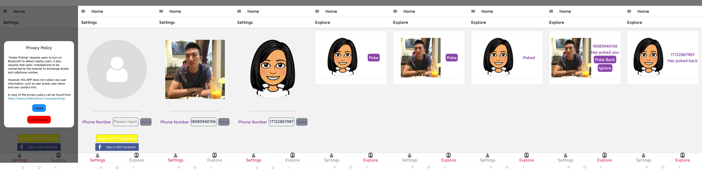

## Avatar Poking
Anonymous, Bluetooth/Proximity based Avatar Dating APP
## Connect with nearby people only when you can see them, via Avatar & Profile Picture
A perfect way for users to kill time when they are waiting/riding public transportations, waiting in airport lounges, or in campus.

## Full Description
### A proximity based social APP
- Connect with nearby people only when you can see them.
- A brand new way to socialize.
- Also a more natural way to connect people.

### Users are presented to nearby users via avatars and profile pictures
One user can only connect with another user when they can see each other.

Online activities and offline activities are integrated in a seamless manner. 

- Step 1: Log in using Facebook account or Snapchat account to set up your avatar/profile picture. (If you don't feel comfortable with using your own photo you can always use your cartoon style avatar. It also adds an extra layer of fun. However if you wear a mask, using your own photo as the profile picture might help nearby users to identify you.)
- Step 2: Put in your phone number.
- Step 3: Explore nearby users avatar/profile picture and identify the user in real life.
- Step 4: 'Poke' the nearby user if you want to connect with her/him.
- Step 5: The nearby user will be notified with your poking and your avatar/profile picture + phone number will be shown up to the nearby user.
- Step 6: The nearby user can identify you and decide whether to 'poke back'.
- Step 7: If the nearby user decides to 'poke back'. You will be notified and her/his phone number will be shown to you.
- Step 8: Once the phone numbers are exchanged you two become friends.

### Note 
- Requires users to turn on Bluetooth to detect nearby users. (Bluetooth is used to make sure only nearby users can connect with each other.)
- Proximity is used instead of the actual location of users.
- The APP does not collect any user information. (Neither your profile avatar nor phone number will be collected. Facebook/Snapchat will be aware of your login, though.)
- Make sure your mobile phone is connected to the Internet to exchange avatar/profile picture and phone number.

## Privacy Policy
"Avatar Poking" requires users to turn on Bluetooth to detect nearby users. It also requires that users' mobilephone to be connected to the Internet to exchange Avatar and cellphone number.

However, this APP does not collect any user information, such as user avatar, user name and user contact info.

## Download the APK files
[arm64 v8a apk file download](https://raw.githubusercontent.com/SeanXu1984/avatarpoking/gh-pages/com.avatar.poking-v1.04(104)-arm64-v8a-release.apk)

[armeabi v7a apk file download](https://raw.githubusercontent.com/SeanXu1984/avatarpoking/gh-pages/com.avatar.poking-v1.04(104)-armeabi-v7a-release.apk)

[x86 apk file download](https://raw.githubusercontent.com/SeanXu1984/avatarpoking/gh-pages/com.avatar.poking-v1.04(104)-x86-release.apk)

[x86_64 apk file download](https://raw.githubusercontent.com/SeanXu1984/avatarpoking/gh-pages/com.avatar.poking-v1.04(104)-x86_64-release.apk)

